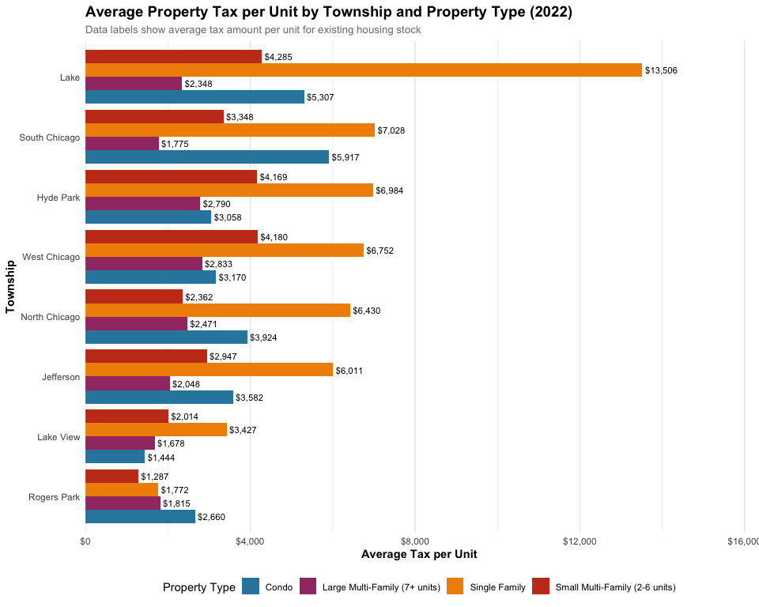
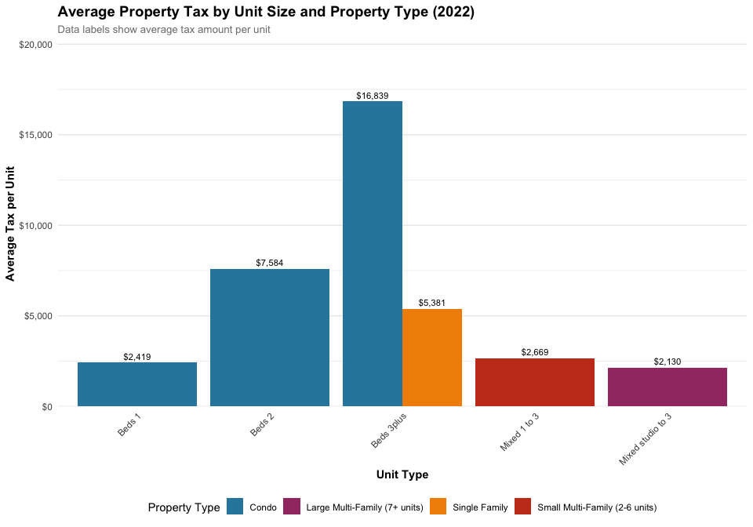
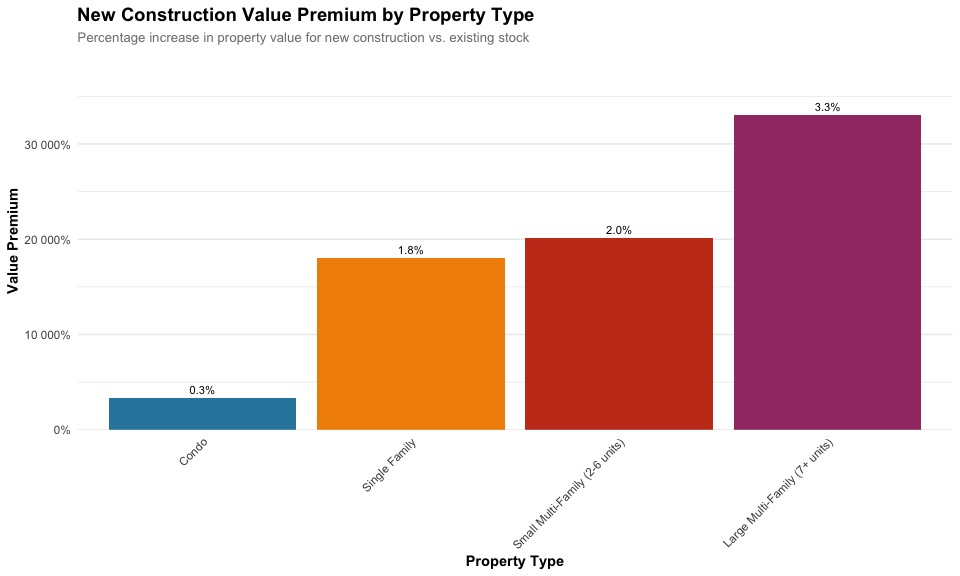
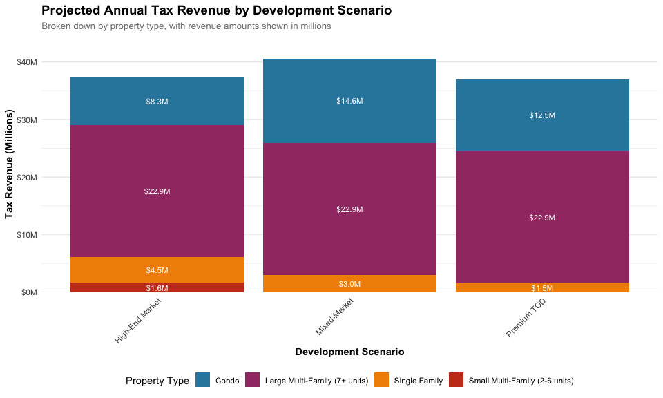
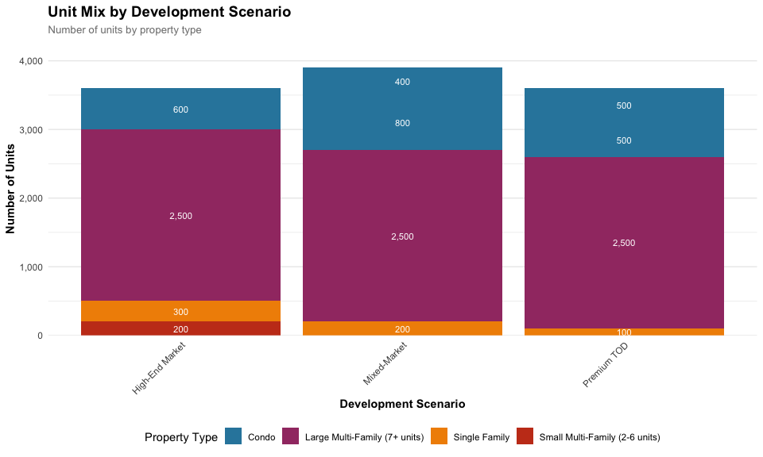
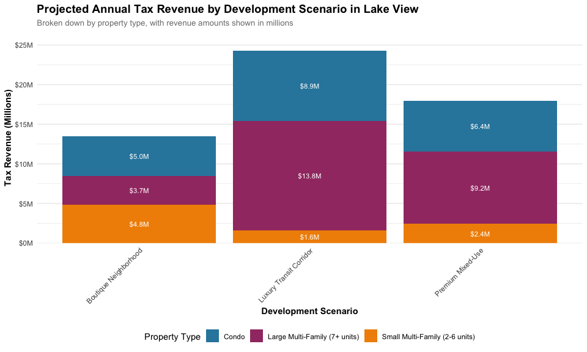
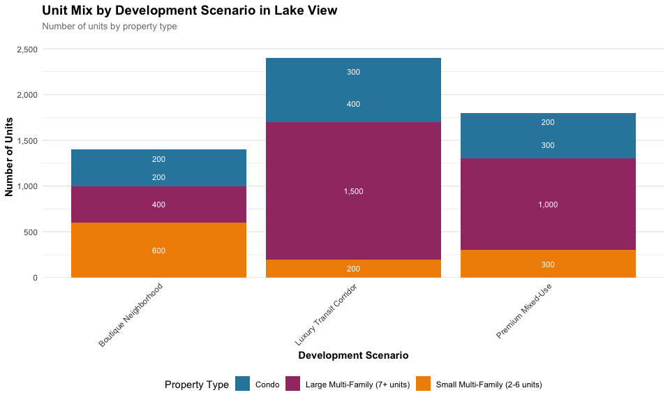

Cook County Property Tax Revenue Analysis
================
Cook County Potential
December 17, 2024

- [Introduction](#introduction)
- [Current Property Tax Landscape](#current-property-tax-landscape)
  - [Geographic Distribution](#geographic-distribution)
  - [Unit Size Analysis](#unit-size-analysis)
- [New Construction Market Analysis](#new-construction-market-analysis)
  - [Current Market Values](#current-market-values)
- [Development Scenarios](#development-scenarios)
  - [1. Premium Transit-Oriented Development
    Scenario](#1-premium-transit-oriented-development-scenario)
  - [2. Mixed-Market Development
    Scenario](#2-mixed-market-development-scenario)
  - [3. High-End Market Scenario](#3-high-end-market-scenario)
- [Case Study: Lake View Township Development
  Potential](#case-study-lake-view-township-development-potential)
  - [Lake View Development Scenarios](#lake-view-development-scenarios)
  - [Lake View Scenario Details](#lake-view-scenario-details)
  - [Lake View Development Insights](#lake-view-development-insights)
- [Methodology Notes](#methodology-notes)

## Introduction

This analysis explores the potential property tax revenue that could be
generated through new housing development in Cook County, with a focus
on Chicago townships. Using actual property tax data from 2021-2022 and
current market values for new construction, we model various scenarios
for housing development and their impact on tax revenue.

## Current Property Tax Landscape

First, let’s examine the current property tax situation across different
housing types and locations, which will serve as our baseline before
applying new construction values.

``` r
# Load the data
summary_data <- read.csv("property_tax_summary.csv")
bedroom_data <- read.csv("property_tax_by_bedroom.csv")
township_data <- read.csv("property_tax_by_township.csv")
new_construction_rates <- read.csv("new_construction_tax_rates.csv")

# Filter for most recent year (2022)
current_summary <- summary_data %>%
  filter(year == 2022) %>%
  select(property_type, avg_tax_per_unit, avg_value_per_unit, effective_tax_rate) %>%
  # Handle NA values in effective tax rate
  mutate(effective_tax_rate = ifelse(is.na(effective_tax_rate), 
                                    avg_tax_per_unit / avg_value_per_unit * 100,
                                    effective_tax_rate))

# Create summary table
kable(current_summary %>%
  mutate(
    avg_tax_per_unit = format_currency(avg_tax_per_unit),
    avg_value_per_unit = format_currency(avg_value_per_unit),
    effective_tax_rate = format_percent(effective_tax_rate)
  ),
  col.names = c("Property Type", "Avg Tax/Unit", "Avg Value/Unit", "Effective Tax Rate"),
  caption = "2022 Property Tax Summary by Housing Type (Existing Housing Stock)")
```

| Property Type | Avg Tax/Unit | Avg Value/Unit | Effective Tax Rate |
|:---|:---|:---|:---|
| Condo | \$5,121 | \$260,034 | 2.0% |
| Large Multi-Family (7+ units) | \$2,130 | \$92,849 | 2.3% |
| Single Family | \$5,381 | \$249,305 | 2.2% |
| Small Multi-Family (2-6 units) | \$2,669 | \$132,752 | 2.0% |

2022 Property Tax Summary by Housing Type (Existing Housing Stock)

### Geographic Distribution

Let’s examine how property taxes vary across Chicago townships. This
geographic analysis helps identify areas where new construction could
generate the highest tax revenue.

``` r
# Create township visualization with improved styling
township_plot <- township_data %>%
  filter(year == 2022) %>%
  ggplot(aes(x = reorder(township, avg_tax_per_unit), 
             y = avg_tax_per_unit, 
             fill = property_type)) +
  geom_bar(stat = "identity", 
           position = position_dodge(width = 0.9)) +
  geom_text(aes(label = scales::dollar(avg_tax_per_unit, accuracy = 1)),
            position = position_dodge(width = 0.9),
            hjust = -0.1,
            size = 3) +
  coord_flip() +
  scale_y_continuous(labels = scales::dollar_format(),
                    expand = expansion(mult = c(0, 0.2))) +
  scale_fill_manual(values = modern_palette) +
  labs(
    title = "Average Property Tax per Unit by Township and Property Type (2022)",
    subtitle = "Data labels show average tax amount per unit for existing housing stock",
    x = "Township",
    y = "Average Tax per Unit",
    fill = "Property Type"
  ) +
  theme_minimal() +
  theme(
    plot.title = element_text(face = "bold", size = 14),
    plot.subtitle = element_text(size = 10, color = "gray50"),
    axis.title = element_text(face = "bold"),
    legend.position = "bottom",
    legend.box = "horizontal",
    panel.grid.major.y = element_blank()
  )

township_plot
```

<!-- -->

### Unit Size Analysis

Different unit sizes have varying tax implications. This analysis of
existing housing stock provides context for our new construction
scenarios:

``` r
# Create bedroom analysis visualization with improved styling
bedroom_plot <- bedroom_data %>%
  filter(year == 2022) %>%
  ggplot(aes(x = bedroom_type, 
             y = avg_tax_per_unit, 
             fill = property_type)) +
  geom_bar(stat = "identity", 
           position = position_dodge(width = 0.9)) +
  geom_text(aes(label = scales::dollar(avg_tax_per_unit, accuracy = 1)),
            position = position_dodge(width = 0.9),
            vjust = -0.5,
            size = 3) +
  scale_y_continuous(labels = scales::dollar_format(),
                    expand = expansion(mult = c(0, 0.2))) +
  scale_fill_manual(values = modern_palette) +
  labs(
    title = "Average Property Tax by Unit Size and Property Type (2022)",
    subtitle = "Data labels show average tax amount per unit for existing housing stock",
    x = "Unit Type",
    y = "Average Tax per Unit",
    fill = "Property Type"
  ) +
  theme_minimal() +
  theme(
    plot.title = element_text(face = "bold", size = 14),
    plot.subtitle = element_text(size = 10, color = "gray50"),
    axis.title = element_text(face = "bold"),
    axis.text.x = element_text(angle = 45, hjust = 1),
    legend.position = "bottom",
    legend.box = "horizontal",
    panel.grid.major.x = element_blank()
  ) +
  scale_x_discrete(labels = function(x) {
    gsub("_", " ", str_to_title(x))
  })

bedroom_plot
```

<!-- -->

## New Construction Market Analysis

Before presenting development scenarios, let’s analyze how new
construction values compare to existing housing stock:

``` r
# Create comparison of existing vs new construction values
value_comparison <- new_construction_rates %>%
  select(property_type, bedroom_type, avg_value_per_unit, new_construction_value, 
         avg_tax_per_unit, new_construction_tax) %>%
  group_by(property_type) %>%
  summarize(
    avg_existing_value = mean(avg_value_per_unit, na.rm = TRUE),
    avg_new_value = mean(new_construction_value, na.rm = TRUE),
    avg_existing_tax = mean(avg_tax_per_unit, na.rm = TRUE),
    avg_new_tax = mean(new_construction_tax, na.rm = TRUE),
    value_premium = (mean(new_construction_value, na.rm = TRUE) / 
                    mean(avg_value_per_unit, na.rm = TRUE) - 1) * 100
  )

# Display value comparison table
kable(value_comparison %>%
  mutate(
    avg_existing_value = format_currency(avg_existing_value),
    avg_new_value = format_currency(avg_new_value),
    avg_existing_tax = format_currency(avg_existing_tax),
    avg_new_tax = format_currency(avg_new_tax),
    value_premium = format_percent(value_premium/100)
  ),
  col.names = c("Property Type", "Existing Value", "New Construction Value", 
                "Existing Tax", "New Construction Tax", "Value Premium"),
  caption = "New Construction Value and Tax Premium by Property Type")
```

| Property Type | Existing Value | New Construction Value | Existing Tax | New Construction Tax | Value Premium |
|:---|:---|:---|:---|:---|:---|
| Condo | \$449,726 | \$600,000 | \$8,947 | \$11,804 | 0.3% |
| Large Multi-Family (7+ units) | \$92,849 | \$400,000 | \$2,130 | \$9,176 | 3.3% |
| Single Family | \$249,305 | \$700,000 | \$5,381 | \$15,110 | 1.8% |
| Small Multi-Family (2-6 units) | \$132,752 | \$400,000 | \$2,669 | \$8,042 | 2.0% |

New Construction Value and Tax Premium by Property Type

``` r
# Create visualization of new construction premiums
premium_plot <- value_comparison %>%
  ggplot(aes(x = reorder(property_type, value_premium), 
             y = value_premium,
             fill = property_type)) +
  geom_bar(stat = "identity") +
  geom_text(aes(label = format_percent(value_premium/100)),
            vjust = -0.5,
            size = 3) +
  scale_y_continuous(labels = scales::percent_format(),
                    expand = expansion(mult = c(0, 0.2))) +
  scale_fill_manual(values = modern_palette) +
  labs(
    title = "New Construction Value Premium by Property Type",
    subtitle = "Percentage increase in property value for new construction vs. existing stock",
    x = "Property Type",
    y = "Value Premium"
  ) +
  theme_minimal() +
  theme(
    plot.title = element_text(face = "bold", size = 14),
    plot.subtitle = element_text(size = 10, color = "gray50"),
    axis.title = element_text(face = "bold"),
    axis.text.x = element_text(angle = 45, hjust = 1),
    legend.position = "none",
    panel.grid.major.x = element_blank()
  )

premium_plot
```

<!-- -->

``` r
# Create detailed value breakdown by bedroom type
value_breakdown <- new_construction_rates %>%
  select(property_type, bedroom_type, avg_value_per_unit, new_construction_value) %>%
  mutate(
    bedroom_type = gsub("_", " ", str_to_title(bedroom_type))
  ) %>%
  arrange(property_type, bedroom_type)

# Display detailed value breakdown
kable(value_breakdown %>%
  mutate(
    avg_value_per_unit = format_currency(avg_value_per_unit),
    new_construction_value = format_currency(new_construction_value)
  ),
  col.names = c("Property Type", "Unit Size", "Existing Value", "New Construction Value"),
  caption = "Detailed Value Comparison by Property Type and Unit Size")
```

| Property Type | Unit Size | Existing Value | New Construction Value |
|:---|:---|:---|:---|
| Condo | Beds 1 | \$125,438 | \$525,000 |
| Condo | Beds 2 | \$386,539 | \$575,000 |
| Condo | Beds 3plus | \$837,201 | \$700,000 |
| Large Multi-Family (7+ units) | Mixed studio to 3 | \$92,849 | \$400,000 |
| Single Family | Beds 3plus | \$249,305 | \$700,000 |
| Small Multi-Family (2-6 units) | Mixed 1 to 3 | \$132,752 | \$400,000 |

Detailed Value Comparison by Property Type and Unit Size

### Current Market Values

New construction in Chicago commands significant premiums, with values
varying by location and property type:

**Single Family Homes**: - Entry-level new construction: \$450,000
(affordable areas) - Median new construction: \$700,000 - Premium
neighborhoods: \$1,500,000+ (Lincoln Park/Lakeview)

**Condominiums**: - Mid-rise neighborhood developments: \$525,000 -
Median new construction: \$575,000 - Luxury high-rise units: \$700,000+

**Multi-Family Developments**: - Mid-market developments:
\$275,000-350,000 per unit - Luxury developments: \$400,000+ per unit -
Focus on larger (20+ unit) buildings

## Development Scenarios

Based on these market values, we model three development scenarios that
reflect current construction patterns:

### 1. Premium Transit-Oriented Development Scenario

This scenario focuses on high-end development near transit: - **1,000
luxury condos**: Mix of high-rise (\$700k+) and mid-rise (\$575k)
units - **2,500 luxury apartment units**: \$400k+ per unit in
amenity-rich buildings - **100 premium single-family homes**: \$1.5M+ in
prime locations

### 2. Mixed-Market Development Scenario

Provides some market diversity while reflecting new construction
economics: - **800 mid-rise condos**: \$525k neighborhood developments -
**400 luxury condos**: \$700k+ units - **2,500 luxury apartment units**:
\$400k+ per unit - **200 median single-family homes**: \$700k new
construction

### 3. High-End Market Scenario

Focuses on luxury segment that dominates new construction: - **600
luxury condos**: \$700k+ high-rise units - **300 premium single-family
homes**: \$1.5M+ in prime areas - **2,500 luxury apartment units**:
\$400k+ per unit - **200 boutique multi-family**: \$400k+ per unit in
smaller buildings

``` r
# Define scenarios with bedroom types that match our tax rate data
scenarios <- tribble(
  ~scenario_name, ~property_type, ~bedroom_type, ~units,
  # Premium TOD
  "Premium TOD", "Condo", "beds_3plus", 500,  # Luxury high-rise
  "Premium TOD", "Condo", "beds_2", 500,      # Mid-rise
  "Premium TOD", "Large Multi-Family (7+ units)", "mixed_studio_to_3", 2500,  # Luxury apartments
  "Premium TOD", "Single Family", "beds_3plus", 100,  # Premium homes
  
  # Mixed-Market
  "Mixed-Market", "Condo", "beds_2", 800,     # Mid-rise
  "Mixed-Market", "Condo", "beds_3plus", 400,  # Luxury
  "Mixed-Market", "Large Multi-Family (7+ units)", "mixed_studio_to_3", 2500,  # All apartments
  "Mixed-Market", "Single Family", "beds_3plus", 200,  # Median new construction
  
  # High-End Market
  "High-End Market", "Condo", "beds_3plus", 600,  # Luxury high-rise
  "High-End Market", "Single Family", "beds_3plus", 300,  # Premium
  "High-End Market", "Large Multi-Family (7+ units)", "mixed_studio_to_3", 2500,  # Luxury
  "High-End Market", "Small Multi-Family (2-6 units)", "mixed_1_to_3", 200  # Boutique
)

# Calculate revenue using new construction tax rates
scenario_results <- scenarios %>%
  left_join(new_construction_rates %>% 
              select(property_type, bedroom_type, new_construction_tax),
            by = c("property_type", "bedroom_type")) %>%
  mutate(tax_revenue = units * new_construction_tax)

# Summarize results
scenario_summary <- scenario_results %>%
  group_by(scenario_name) %>%
  summarize(
    total_units = sum(units),
    total_revenue = sum(tax_revenue),
    revenue_per_unit = total_revenue / total_units
  )

# Display summary table
kable(scenario_summary %>%
  mutate(
    total_units = format_number(total_units),
    total_revenue = format_currency(total_revenue),
    revenue_per_unit = format_currency(revenue_per_unit)
  ),
  col.names = c("Scenario", "Total Units", "Annual Tax Revenue", "Revenue per Unit"),
  caption = "Projected Annual Tax Revenue by Development Scenario")
```

| Scenario        | Total Units | Annual Tax Revenue | Revenue per Unit |
|:----------------|:------------|:-------------------|:-----------------|
| High-End Market | 3,600       | \$37,345,729       | \$10,374         |
| Mixed-Market    | 3,900       | \$40,521,965       | \$10,390         |
| Premium TOD     | 3,600       | \$36,994,354       | \$10,276         |

Projected Annual Tax Revenue by Development Scenario

``` r
# Create scenario visualization
scenario_plot <- scenario_results %>%
  group_by(scenario_name, property_type) %>%
  summarize(tax_revenue = sum(tax_revenue), .groups = 'drop') %>%
  ggplot(aes(x = scenario_name, 
             y = tax_revenue/1e6, 
             fill = property_type)) +
  geom_bar(stat = "identity", position = "stack") +
  geom_text(aes(label = scales::dollar(tax_revenue/1e6, accuracy = 0.1, suffix = "M")),
            position = position_stack(vjust = 0.5),
            color = "white",
            size = 3) +
  scale_y_continuous(labels = scales::dollar_format(suffix = "M"),
                    expand = expansion(mult = c(0, 0.1))) +
  scale_fill_manual(values = modern_palette) +
  labs(
    title = "Projected Annual Tax Revenue by Development Scenario",
    subtitle = "Broken down by property type, with revenue amounts shown in millions",
    x = "Development Scenario",
    y = "Tax Revenue (Millions)",
    fill = "Property Type"
  ) +
  theme_minimal() +
  theme(
    plot.title = element_text(face = "bold", size = 14),
    plot.subtitle = element_text(size = 10, color = "gray50"),
    axis.title = element_text(face = "bold"),
    axis.text.x = element_text(angle = 45, hjust = 1),
    legend.position = "bottom",
    legend.box = "horizontal",
    panel.grid.major.x = element_blank()
  )

scenario_plot
```

<!-- -->

``` r
# Create unit mix visualization
unit_mix_plot <- scenario_results %>%
  ggplot(aes(x = scenario_name, 
             y = units, 
             fill = property_type)) +
  geom_bar(stat = "identity", position = "stack") +
  geom_text(aes(label = format_number(units)),
            position = position_stack(vjust = 0.5),
            color = "white",
            size = 3) +
  scale_y_continuous(labels = scales::comma_format(),
                    expand = expansion(mult = c(0, 0.1))) +
  scale_fill_manual(values = modern_palette) +
  labs(
    title = "Unit Mix by Development Scenario",
    subtitle = "Number of units by property type",
    x = "Development Scenario",
    y = "Number of Units",
    fill = "Property Type"
  ) +
  theme_minimal() +
  theme(
    plot.title = element_text(face = "bold", size = 14),
    plot.subtitle = element_text(size = 10, color = "gray50"),
    axis.title = element_text(face = "bold"),
    axis.text.x = element_text(angle = 45, hjust = 1),
    legend.position = "bottom",
    legend.box = "horizontal",
    panel.grid.major.x = element_blank()
  )

unit_mix_plot
```

<!-- -->

## Case Study: Lake View Township Development Potential

To better understand the specific impact of new housing development in
different areas, let’s examine Lake View township as a detailed case
study, incorporating current market values for new construction.

``` r
# Filter data for Lake View township and calculate effective tax rate
lakeview_data <- township_data %>%
  filter(year == 2022, township == "LAKE VIEW") %>%
  arrange(desc(avg_tax_per_unit)) %>%
  # Calculate effective tax rate
  mutate(effective_tax_rate = (avg_tax_per_unit / avg_value_per_unit) * 100)

# Create summary table for Lake View
kable(lakeview_data %>%
  select(year, township, property_type, avg_tax_per_unit, avg_value_per_unit, effective_tax_rate) %>%
  mutate(
    avg_tax_per_unit = format_currency(avg_tax_per_unit),
    avg_value_per_unit = format_currency(avg_value_per_unit),
    effective_tax_rate = format_percent(effective_tax_rate)
  ),
  col.names = c("Year", "Township", "Property Type", "Avg Tax/Unit", "Avg Value/Unit", "Effective Tax Rate"),
  caption = "Current Property Tax Metrics in Lake View Township (2022)")
```

| Year | Township | Property Type | Avg Tax/Unit | Avg Value/Unit | Effective Tax Rate |
|-----:|:---------|:--------------|:-------------|:---------------|:-------------------|

Current Property Tax Metrics in Lake View Township (2022)

``` r
# Calculate township-specific metrics
lakeview_metrics <- lakeview_data %>%
  summarize(
    avg_tax_all_types = mean(avg_tax_per_unit),
    max_tax = max(avg_tax_per_unit),
    min_tax = min(avg_tax_per_unit)
  )
```

### Lake View Development Scenarios

Based on Lake View’s premium location and current market values, we’ll
model three targeted scenarios:

``` r
# Define Lake View specific scenarios with matching bedroom types
lakeview_scenarios <- tribble(
  ~scenario_name, ~property_type, ~bedroom_type, ~units,
  # Luxury Transit Corridor
  "Luxury Transit Corridor", "Condo", "beds_3plus", 400,  # Premium high-rise
  "Luxury Transit Corridor", "Condo", "beds_2", 300,      # Luxury mid-rise
  "Luxury Transit Corridor", "Large Multi-Family (7+ units)", "mixed_studio_to_3", 1500,  # Luxury apartments
  "Luxury Transit Corridor", "Small Multi-Family (2-6 units)", "mixed_1_to_3", 200,  # Boutique
  
  # Premium Mixed-Use
  "Premium Mixed-Use", "Condo", "beds_3plus", 300,  # Luxury units
  "Premium Mixed-Use", "Condo", "beds_2", 200,      # Mid-rise
  "Premium Mixed-Use", "Large Multi-Family (7+ units)", "mixed_studio_to_3", 1000,  # Luxury
  "Premium Mixed-Use", "Small Multi-Family (2-6 units)", "mixed_1_to_3", 300,  # Boutique
  
  # Boutique Neighborhood
  "Boutique Neighborhood", "Condo", "beds_3plus", 200,  # Luxury
  "Boutique Neighborhood", "Condo", "beds_2", 200,      # Mid-rise
  "Boutique Neighborhood", "Small Multi-Family (2-6 units)", "mixed_1_to_3", 600,  # Boutique
  "Boutique Neighborhood", "Large Multi-Family (7+ units)", "mixed_studio_to_3", 400   # Smaller luxury buildings
)

# Calculate revenue using new construction tax rates
lakeview_results <- lakeview_scenarios %>%
  left_join(new_construction_rates %>% 
              select(property_type, bedroom_type, new_construction_tax),
            by = c("property_type", "bedroom_type")) %>%
  mutate(tax_revenue = units * new_construction_tax)

# Summarize Lake View scenario results
lakeview_summary <- lakeview_results %>%
  group_by(scenario_name) %>%
  summarize(
    total_units = sum(units),
    total_revenue = sum(tax_revenue),
    revenue_per_unit = total_revenue / total_units,
    .groups = 'drop'
  )

# Display Lake View summary table
kable(lakeview_summary %>%
  mutate(
    total_units = format_number(total_units),
    total_revenue = format_currency(total_revenue),
    revenue_per_unit = format_currency(revenue_per_unit)
  ),
  col.names = c("Scenario", "Total Units", "Annual Tax Revenue", "Revenue per Unit"),
  caption = "Projected Annual Tax Revenue by Development Scenario in Lake View")
```

| Scenario                | Total Units | Annual Tax Revenue | Revenue per Unit |
|:------------------------|:------------|:-------------------|:-----------------|
| Boutique Neighborhood   | 1,400       | \$13,512,939       | \$9,652          |
| Luxury Transit Corridor | 2,400       | \$24,275,683       | \$10,115         |
| Premium Mixed-Use       | 1,800       | \$17,983,258       | \$9,991          |

Projected Annual Tax Revenue by Development Scenario in Lake View

``` r
# Create visualization for Lake View scenarios
lakeview_plot <- lakeview_results %>%
  group_by(scenario_name, property_type) %>%
  summarize(tax_revenue = sum(tax_revenue), .groups = 'drop') %>%
  ggplot(aes(x = scenario_name, 
             y = tax_revenue/1e6, 
             fill = property_type)) +
  geom_bar(stat = "identity", position = "stack") +
  geom_text(aes(label = scales::dollar(tax_revenue/1e6, accuracy = 0.1, suffix = "M")),
            position = position_stack(vjust = 0.5),
            color = "white",
            size = 3) +
  scale_y_continuous(labels = scales::dollar_format(suffix = "M"),
                    expand = expansion(mult = c(0, 0.1))) +
  scale_fill_manual(values = modern_palette) +
  labs(
    title = "Projected Annual Tax Revenue by Development Scenario in Lake View",
    subtitle = "Broken down by property type, with revenue amounts shown in millions",
    x = "Development Scenario",
    y = "Tax Revenue (Millions)",
    fill = "Property Type"
  ) +
  theme_minimal() +
  theme(
    plot.title = element_text(face = "bold", size = 14),
    plot.subtitle = element_text(size = 10, color = "gray50"),
    axis.title = element_text(face = "bold"),
    axis.text.x = element_text(angle = 45, hjust = 1),
    legend.position = "bottom",
    legend.box = "horizontal",
    panel.grid.major.x = element_blank()
  )

lakeview_plot
```

<!-- -->

``` r
# Create Lake View unit mix visualization
lakeview_unit_mix <- lakeview_results %>%
  ggplot(aes(x = scenario_name, 
             y = units, 
             fill = property_type)) +
  geom_bar(stat = "identity", position = "stack") +
  geom_text(aes(label = format_number(units)),
            position = position_stack(vjust = 0.5),
            color = "white",
            size = 3) +
  scale_y_continuous(labels = scales::comma_format(),
                    expand = expansion(mult = c(0, 0.1))) +
  scale_fill_manual(values = modern_palette) +
  labs(
    title = "Unit Mix by Development Scenario in Lake View",
    subtitle = "Number of units by property type",
    x = "Development Scenario",
    y = "Number of Units",
    fill = "Property Type"
  ) +
  theme_minimal() +
  theme(
    plot.title = element_text(face = "bold", size = 14),
    plot.subtitle = element_text(size = 10, color = "gray50"),
    axis.title = element_text(face = "bold"),
    axis.text.x = element_text(angle = 45, hjust = 1),
    legend.position = "bottom",
    legend.box = "horizontal",
    panel.grid.major.x = element_blank()
  )

lakeview_unit_mix
```

<!-- -->

### Lake View Scenario Details

1.  **Luxury Transit Corridor Development** (2,400 total units)
    - Premium high-rise condos: 400 units at \$700k+
    - Luxury mid-rise condos: 300 units at \$575k+
    - Luxury apartments: 1,500 units at \$400k+ per unit
    - Boutique multi-family: 200 units at \$400k+ per unit
    - Projected annual revenue: \$13,512,939
2.  **Premium Mixed-Use Development** (1,800 total units)
    - Luxury condos: 300 units at \$700k+
    - Mid-rise condos: 200 units at \$575k
    - Luxury apartments: 1,000 units at \$400k+ per unit
    - Boutique multi-family: 300 units at \$400k+ per unit
    - Projected annual revenue: \$24,275,683
3.  **Boutique Neighborhood Development** (1,400 total units)
    - Luxury condos: 200 units at \$700k+
    - Mid-rise condos: 200 units at \$575k
    - Boutique multi-family: 600 units at \$400k+ per unit
    - Smaller luxury buildings: 400 units at \$400k+ per unit
    - Projected annual revenue: \$17,983,258

### Lake View Development Insights

1.  **Revenue Generation**:
    - Luxury Transit Corridor scenario generates the highest total
      revenue at \$13,512,939 annually
    - Premium Mixed-Use approach provides balanced revenue of
      \$24,275,683 annually
    - Boutique Neighborhood generates \$17,983,258 while maintaining
      neighborhood character
2.  **Unit Mix Considerations**:
    - Premium large multi-family developments drive significant revenue
    - Luxury condos provide strong per-unit revenue
    - Boutique multi-family buildings balance revenue and neighborhood
      context
3.  **Location Strategy**:
    - Focus luxury high-density development along major transit
      corridors
    - Distribute boutique developments throughout neighborhoods
    - Strategic placement of premium developments near existing
      amenities
4.  **Implementation Recommendations**:
    - Phase development starting with transit-adjacent parcels
    - Coordinate with CTA on premium TOD opportunities
    - Implement design guidelines for high-end development
    - Consider TIF districts for infrastructure improvements

## Methodology Notes

This analysis uses actual property tax data from Cook County for
2021-2022, with adjustments based on current market values for new
construction:

**New Construction Values**: - Single Family Homes: \* Entry-level:
\$450,000 \* Median: \$700,000 \* Premium: \$1,500,000+ - Condominiums:
\* Mid-rise: \$525,000 \* Median: \$575,000 \* Luxury: \$700,000+ -
Multi-Family: \* Mid-market: \$275,000-350,000 per unit \* Luxury:
\$400,000+ per unit

These values are based on: - Current market conditions in Chicago -
Recent new construction sales data - Developer pro forma requirements -
Construction cost analysis - Location value assessment

Data sources: - Cook County Assessor’s Office - Property tax bills from
2021-2022 - Township-level assessment data - Market analysis of new
construction prices - Developer pro forma analysis - Construction cost
data

Note on New Construction Values: The values used reflect actual market
conditions and recent sales data for new construction in Chicago,
providing a more accurate picture of potential tax revenue from new
development.
