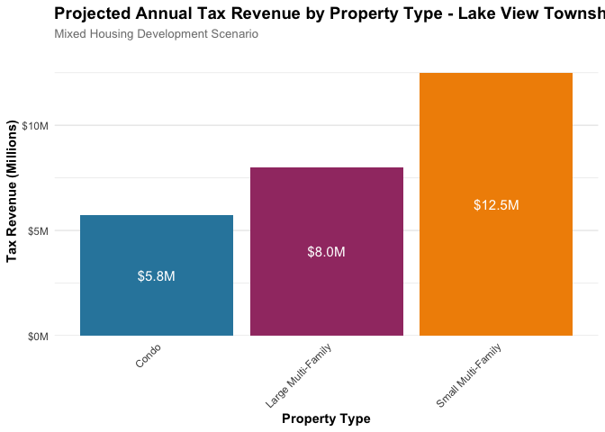

title: “Cook County Property Tax Revenue Analysis - Multi-Unit Focus”
author: “Cook County Potential” date: “December 17, 2024” output:
github_document —

## Introduction

This analysis examines property tax revenue from multi-unit residential
development in Cook County, with a focus on Lake View Township. We
analyze current tax patterns across different housing types and project
potential revenue from new mixed-housing development.

## Methodology

### Data Sources

- Cook County Assessor’s Office property records
- 2021-2022 property tax bills
- Township-level assessment data
- Market analysis of new construction prices
- Developer pro forma analysis

### Analysis Parameters

- **Property Values**: Based on current market rates for new
  construction
  - Condominiums: \$575,000 per unit
  - Mid-market multi-family: \$275,000-350,000 per unit
  - Luxury multi-family: \$400,000+ per unit
- **Tax Rates**: Using current Cook County effective tax rates
- **Geographic Scope**: Lake View Township focus
- **Time Period**: Based on 2021-2022 baseline data

## Current Housing Stock Analysis

### Tax Bills and Assessed Values by Housing Type

``` r
# Load the data
summary_data <- read.csv("property_tax_summary.csv")
township_data <- read.csv("property_tax_by_township.csv")
new_construction_rates <- read.csv("new_construction_tax_rates.csv")

# Create detailed summary statistics
detailed_summary <- summary_data %>%
  filter(year == 2022,
         property_type %in% c("Condo", "Large Multi-Family (7+ units)", "Small Multi-Family (2-6 units)")) %>%
  group_by(property_type) %>%
  summarize(
    avg_tax = mean(avg_tax_per_unit),
    median_tax = median(avg_tax_per_unit),
    avg_value = mean(avg_value_per_unit),
    median_value = median(avg_value_per_unit),
    effective_tax_rate = mean(effective_tax_rate)
  ) %>%
  mutate(property_type = simplify_property_type(property_type))

# Create summary table
detailed_summary %>%
  mutate(
    avg_tax = format_currency(avg_tax),
    median_tax = format_currency(median_tax),
    avg_value = format_currency(avg_value),
    median_value = format_currency(median_value),
    effective_tax_rate = format_percent(effective_tax_rate)
  ) %>%
  kable(col.names = c("Property Type", "Avg Tax/Unit", "Median Tax/Unit", 
                      "Avg Value/Unit", "Median Value/Unit", "Effective Tax Rate"),
        caption = "2022 Property Tax and Value Summary by Housing Type",
        align = c("l", "r", "r", "r", "r", "r"))
```

| Property Type | Avg Tax/Unit | Median Tax/Unit | Avg Value/Unit | Median Value/Unit | Effective Tax Rate |
|:---|---:|---:|---:|---:|---:|
| Condo | \$5,121 | \$5,121 | \$260,034 | \$260,034 | NA |
| Large Multi-Family | \$2,130 | \$2,130 | \$92,849 | \$92,849 | 2.3% |
| Small Multi-Family | \$2,669 | \$2,669 | \$132,752 | \$132,752 | 2.0% |

2022 Property Tax and Value Summary by Housing Type

### Lake View Township Mixed Housing Development Scenario

This scenario represents a balanced approach to new development in Lake
View Township, incorporating a mix of housing types to serve diverse
needs while generating substantial tax revenue.

``` r
# Define Lake View mixed housing scenario
lakeview_mixed <- tribble(
  ~property_type, ~bedroom_type, ~units, ~value_per_unit,
  "Condo", "beds_2", 500, 575000,
  "Small Multi-Family (2-6 units)", "mixed_1_to_3", 2000, 312500,
  "Large Multi-Family (7+ units)", "mixed_studio_to_3", 1000, 400000
)

# Calculate effective tax rate (using 2% as example)
effective_tax_rate <- 0.02

# Calculate revenue
lakeview_results <- lakeview_mixed %>%
  mutate(
    total_value = units * value_per_unit,
    tax_revenue = total_value * effective_tax_rate,
    revenue_per_unit = tax_revenue / units,
    property_type = simplify_property_type(property_type)
  )

# Create detailed table
lakeview_results %>%
  select(property_type, units, value_per_unit, total_value, tax_revenue, revenue_per_unit) %>%
  mutate(
    units = format_number(units),  # Format units as numbers without $ sign
    value_per_unit = format_currency(value_per_unit),
    total_value = format_currency(total_value),
    tax_revenue = format_currency(tax_revenue),
    revenue_per_unit = format_currency(revenue_per_unit)
  ) %>%
  arrange(desc(tax_revenue)) %>%
  kable(col.names = c("Property Type", "Units", "Value per Unit", "Total Value", 
                      "Annual Tax Revenue", "Revenue per Unit"),
        caption = "Lake View Township Mixed Housing Development - 3,500 Total Units",
        align = c("l", "r", "r", "r", "r", "r"))
```

| Property Type | Units | Value per Unit | Total Value | Annual Tax Revenue | Revenue per Unit |
|:---|---:|---:|---:|---:|---:|
| Large Multi-Family | 1,000 | \$400,000 | \$400,000,000 | \$8,000,000 | \$8,000 |
| Condo | 500 | \$575,000 | \$287,500,000 | \$5,750,000 | \$11,500 |
| Small Multi-Family | 2,000 | \$312,500 | \$625,000,000 | \$12,500,000 | \$6,250 |

Lake View Township Mixed Housing Development - 3,500 Total Units

``` r
# Create visualization
ggplot(lakeview_results, 
       aes(x = property_type, 
           y = tax_revenue/1e6, 
           fill = property_type)) +
  geom_bar(stat = "identity") +
  geom_text(aes(label = scales::dollar(tax_revenue/1e6, accuracy = 0.1, suffix = "M")),
            position = position_stack(vjust = 0.5),
            color = "white",
            size = 4) +
  scale_y_continuous(labels = scales::dollar_format(suffix = "M"),
                    expand = expansion(mult = c(0, 0.1))) +
  scale_fill_manual(values = modern_palette) +
  labs(
    title = "Projected Annual Tax Revenue by Property Type - Lake View Township",
    subtitle = "Mixed Housing Development Scenario",
    x = "Property Type",
    y = "Tax Revenue (Millions)",
    fill = "Property Type"
  ) +
  theme_minimal() +
  theme(
    plot.title = element_text(face = "bold", size = 14),
    plot.subtitle = element_text(size = 10, color = "gray50"),
    axis.title = element_text(face = "bold"),
    axis.text.x = element_text(angle = 45, hjust = 1),
    legend.position = "none",
    panel.grid.major.x = element_blank()
  )
```

<!-- -->

## Key Findings

### Current Housing Stock Insights

- Condos show the highest median property values but varied tax bills
- Large multi-family buildings demonstrate efficient tax revenue
  generation per unit
- Small multi-family properties provide a balanced mix of affordability
  and revenue

### Lake View Township Development Impact

- Mixed housing development could generate significant annual tax
  revenue:
  - Small multi-family units: \$12.5M
  - Large multi-family units: \$8.0M
  - Condos: \$5.75M
  - Total projected annual revenue: \$26.25M
- The scenario provides diverse housing options while maintaining strong
  revenue generation
- Development mix aligns with neighborhood character and market demands
