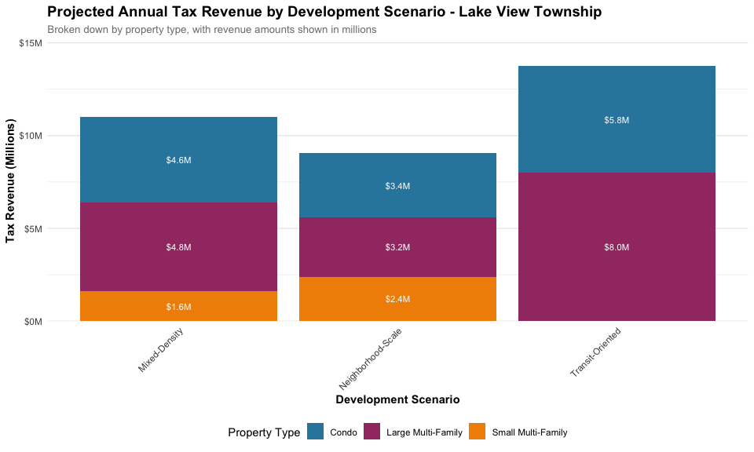

Cook County Property Tax Revenue Analysis - Multi-Unit Focus
================
Cook County Potential
December 17, 2024

- [Introduction](#introduction)
- [Market Values for Analysis](#market-values-for-analysis)
- [Citywide Development Scenarios](#citywide-development-scenarios)
  - [Citywide Scenario Details](#citywide-scenario-details)
- [Lake View Township Analysis](#lake-view-township-analysis)
  - [Lake View Scenario Details](#lake-view-scenario-details)
- [Key Findings](#key-findings)
- [Methodology Notes](#methodology-notes)

## Introduction

This analysis explores the potential property tax revenue from new
multi-unit residential development in Cook County, focusing specifically
on condominiums and multi-family buildings. We examine scenarios both
citywide and within Lake View Township, using current market values for
new construction.

## Market Values for Analysis

For this analysis, we use the following new construction values:

**Condominiums**: - Standard new construction: \$575,000 per unit

**Multi-Family Developments**: - Mid-market: \$275,000-350,000 per
unit - Luxury: \$400,000+ per unit

``` r
# Load the data
summary_data <- read.csv("property_tax_summary.csv")
township_data <- read.csv("property_tax_by_township.csv")
new_construction_rates <- read.csv("new_construction_tax_rates.csv")

# Filter for most recent year and multi-unit properties
current_summary <- summary_data %>%
  filter(year == 2022,
         property_type %in% c("Condo", "Large Multi-Family (7+ units)", "Small Multi-Family (2-6 units)")) %>%
  select(property_type, avg_tax_per_unit, avg_value_per_unit, effective_tax_rate) %>%
  mutate(
    effective_tax_rate = ifelse(is.na(effective_tax_rate), 
                               avg_tax_per_unit / avg_value_per_unit * 100,
                               effective_tax_rate),
    property_type = simplify_property_type(property_type)
  )

# Create summary table with enhanced styling
kable(current_summary %>%
  mutate(
    avg_tax_per_unit = format_currency(avg_tax_per_unit),
    avg_value_per_unit = format_currency(avg_value_per_unit),
    effective_tax_rate = format_percent(effective_tax_rate)
  ),
  col.names = c("Property Type", "Avg Tax/Unit", "Avg Value/Unit", "Effective Tax Rate"),
  caption = "2022 Property Tax Summary by Housing Type (Existing Multi-Unit Stock)",
  align = c("l", "r", "r", "r")
) %>% style_table()
```

<table class="table table-striped table-hover table-condensed table-bordered" style="font-size: 12px; width: auto !important; ">

<caption style="font-size: initial !important;">

2022 Property Tax Summary by Housing Type (Existing Multi-Unit Stock)
</caption>

<thead>

<tr>

<th style="text-align:left;font-weight: bold;color: white !important;background-color: rgba(46, 134, 171, 255) !important;">

Property Type
</th>

<th style="text-align:right;font-weight: bold;color: white !important;background-color: rgba(46, 134, 171, 255) !important;">

Avg Tax/Unit
</th>

<th style="text-align:right;font-weight: bold;color: white !important;background-color: rgba(46, 134, 171, 255) !important;">

Avg Value/Unit
</th>

<th style="text-align:right;font-weight: bold;color: white !important;background-color: rgba(46, 134, 171, 255) !important;">

Effective Tax Rate
</th>

</tr>

</thead>

<tbody>

<tr>

<td style="text-align:left;">

Condo
</td>

<td style="text-align:right;">

\$5,121
</td>

<td style="text-align:right;">

\$260,034
</td>

<td style="text-align:right;">

2.0%
</td>

</tr>

<tr>

<td style="text-align:left;">

Large Multi-Family
</td>

<td style="text-align:right;">

\$2,130
</td>

<td style="text-align:right;">

\$92,849
</td>

<td style="text-align:right;">

2.3%
</td>

</tr>

<tr>

<td style="text-align:left;">

Small Multi-Family
</td>

<td style="text-align:right;">

\$2,669
</td>

<td style="text-align:right;">

\$132,752
</td>

<td style="text-align:right;">

2.0%
</td>

</tr>

</tbody>

</table>

## Citywide Development Scenarios

We model three development scenarios that reflect different approaches
to multi-unit development across Chicago:

``` r
# Define citywide scenarios
citywide_scenarios <- tribble(
  ~scenario_name, ~property_type, ~bedroom_type, ~units, ~value_per_unit,
  # High-Density Mixed
  "High-Density Mixed", "Condo", "beds_2", 1000, 575000,  # Standard condos
  "High-Density Mixed", "Large Multi-Family (7+ units)", "mixed_studio_to_3", 2000, 400000,  # Luxury apartments
  "High-Density Mixed", "Large Multi-Family (7+ units)", "mixed_studio_to_3", 1000, 312500,  # Mid-market (avg of 275-350k)
  
  # Luxury-Focused
  "Luxury-Focused", "Condo", "beds_2", 1500, 575000,  # Standard condos
  "Luxury-Focused", "Large Multi-Family (7+ units)", "mixed_studio_to_3", 2500, 400000,  # Luxury apartments
  
  # Balanced Development
  "Balanced Development", "Condo", "beds_2", 800, 575000,  # Standard condos
  "Balanced Development", "Large Multi-Family (7+ units)", "mixed_studio_to_3", 1500, 400000,  # Luxury apartments
  "Balanced Development", "Large Multi-Family (7+ units)", "mixed_studio_to_3", 1500, 312500,  # Mid-market
  "Balanced Development", "Small Multi-Family (2-6 units)", "mixed_1_to_3", 500, 312500   # Mid-market smaller buildings
)

# Calculate effective tax rate (using 2% as example)
effective_tax_rate <- 0.02

# Calculate revenue
citywide_results <- citywide_scenarios %>%
  mutate(
    total_value = units * value_per_unit,
    tax_revenue = total_value * effective_tax_rate,
    property_type = simplify_property_type(property_type)
  )

# Create detailed summary with subtotals
citywide_detailed <- bind_rows(
  # High-Density Mixed details and subtotal
  citywide_results %>%
    filter(scenario_name == "High-Density Mixed") %>%
    mutate(row_type = "detail"),
  citywide_results %>%
    filter(scenario_name == "High-Density Mixed") %>%
    summarize(
      scenario_name = first(scenario_name),
      property_type = "SUBTOTAL",
      units = sum(units),
      total_value = sum(total_value),
      tax_revenue = sum(tax_revenue),
      row_type = "subtotal"
    ),
  
  # Add spacing row
  tibble(
    scenario_name = "",
    property_type = "",
    units = NA,
    total_value = NA,
    tax_revenue = NA,
    row_type = "spacing"
  ),
  
  # Luxury-Focused details and subtotal
  citywide_results %>%
    filter(scenario_name == "Luxury-Focused") %>%
    mutate(row_type = "detail"),
  citywide_results %>%
    filter(scenario_name == "Luxury-Focused") %>%
    summarize(
      scenario_name = first(scenario_name),
      property_type = "SUBTOTAL",
      units = sum(units),
      total_value = sum(total_value),
      tax_revenue = sum(tax_revenue),
      row_type = "subtotal"
    ),
  
  # Add spacing row
  tibble(
    scenario_name = "",
    property_type = "",
    units = NA,
    total_value = NA,
    tax_revenue = NA,
    row_type = "spacing"
  ),
  
  # Balanced Development details and subtotal
  citywide_results %>%
    filter(scenario_name == "Balanced Development") %>%
    mutate(row_type = "detail"),
  citywide_results %>%
    filter(scenario_name == "Balanced Development") %>%
    summarize(
      scenario_name = first(scenario_name),
      property_type = "SUBTOTAL",
      units = sum(units),
      total_value = sum(total_value),
      tax_revenue = sum(tax_revenue),
      row_type = "subtotal"
    ),
  
  # Add spacing row
  tibble(
    scenario_name = "",
    property_type = "",
    units = NA,
    total_value = NA,
    tax_revenue = NA,
    row_type = "spacing"
  ),
  
  # Grand total
  citywide_results %>%
    summarize(
      scenario_name = "GRAND TOTAL",
      property_type = "",
      units = sum(units),
      total_value = sum(total_value),
      tax_revenue = sum(tax_revenue),
      row_type = "total"
    )
) %>%
  mutate(
    revenue_per_unit = tax_revenue / units,
    # Format the display strings
    units_display = ifelse(is.na(units), "", format_number(units)),
    value_display = ifelse(is.na(total_value), "", format_currency(total_value)),
    revenue_display = ifelse(is.na(tax_revenue), "", format_currency(tax_revenue)),
    revenue_per_unit_display = ifelse(is.na(revenue_per_unit), "", format_currency(revenue_per_unit)),
    # Create more concise unit mix description
    unit_mix = case_when(
      row_type == "detail" ~ sprintf("%s: %s units @ %s",
                                    property_type,
                                    format_number(units),
                                    format_currency(value_per_unit)),
      row_type == "subtotal" ~ sprintf("Total: %s units", format_number(units)),
      TRUE ~ ""
    )
  )

# Display detailed table with enhanced styling
kable(
  citywide_detailed %>%
    select(scenario_name, unit_mix, units_display, value_display, revenue_display, revenue_per_unit_display) %>%
    rename(
      Scenario = scenario_name,
      `Unit Mix` = unit_mix,
      Units = units_display,
      `Development Value` = value_display,
      `Annual Tax Revenue` = revenue_display,
      `Revenue per Unit` = revenue_per_unit_display
    ),
  caption = "Detailed Development Scenarios - Citywide",
  align = c("l", "l", "r", "r", "r", "r")
) %>% style_table()
```

<table class="table table-striped table-hover table-condensed table-bordered" style="font-size: 12px; width: auto !important; ">

<caption style="font-size: initial !important;">

Detailed Development Scenarios - Citywide
</caption>

<thead>

<tr>

<th style="text-align:left;font-weight: bold;color: white !important;background-color: rgba(46, 134, 171, 255) !important;">

Scenario
</th>

<th style="text-align:left;font-weight: bold;color: white !important;background-color: rgba(46, 134, 171, 255) !important;">

Unit Mix
</th>

<th style="text-align:right;font-weight: bold;color: white !important;background-color: rgba(46, 134, 171, 255) !important;">

Units
</th>

<th style="text-align:right;font-weight: bold;color: white !important;background-color: rgba(46, 134, 171, 255) !important;">

Development Value
</th>

<th style="text-align:right;font-weight: bold;color: white !important;background-color: rgba(46, 134, 171, 255) !important;">

Annual Tax Revenue
</th>

<th style="text-align:right;font-weight: bold;color: white !important;background-color: rgba(46, 134, 171, 255) !important;">

Revenue per Unit
</th>

</tr>

</thead>

<tbody>

<tr>

<td style="text-align:left;">

High-Density Mixed
</td>

<td style="text-align:left;">

Condo: 1,000 units @ \$575,000
</td>

<td style="text-align:right;">

1,000
</td>

<td style="text-align:right;">

\$575,000,000
</td>

<td style="text-align:right;">

\$11,500,000
</td>

<td style="text-align:right;">

\$11,500
</td>

</tr>

<tr>

<td style="text-align:left;">

High-Density Mixed
</td>

<td style="text-align:left;">

Large Multi-Family: 2,000 units @ \$400,000
</td>

<td style="text-align:right;">

2,000
</td>

<td style="text-align:right;">

\$800,000,000
</td>

<td style="text-align:right;">

\$16,000,000
</td>

<td style="text-align:right;">

\$8,000
</td>

</tr>

<tr>

<td style="text-align:left;">

High-Density Mixed
</td>

<td style="text-align:left;">

Large Multi-Family: 1,000 units @ \$312,500
</td>

<td style="text-align:right;">

1,000
</td>

<td style="text-align:right;">

\$312,500,000
</td>

<td style="text-align:right;">

\$6,250,000
</td>

<td style="text-align:right;">

\$6,250
</td>

</tr>

<tr>

<td style="text-align:left;">

High-Density Mixed
</td>

<td style="text-align:left;">

Total: 4,000 units
</td>

<td style="text-align:right;">

4,000
</td>

<td style="text-align:right;">

\$1,687,500,000
</td>

<td style="text-align:right;">

\$33,750,000
</td>

<td style="text-align:right;">

\$8,438
</td>

</tr>

<tr>

<td style="text-align:left;">

</td>

<td style="text-align:left;">

</td>

<td style="text-align:right;">

</td>

<td style="text-align:right;">

</td>

<td style="text-align:right;">

</td>

<td style="text-align:right;">

</td>

</tr>

<tr>

<td style="text-align:left;">

Luxury-Focused
</td>

<td style="text-align:left;">

Condo: 1,500 units @ \$575,000
</td>

<td style="text-align:right;">

1,500
</td>

<td style="text-align:right;">

\$862,500,000
</td>

<td style="text-align:right;">

\$17,250,000
</td>

<td style="text-align:right;">

\$11,500
</td>

</tr>

<tr>

<td style="text-align:left;">

Luxury-Focused
</td>

<td style="text-align:left;">

Large Multi-Family: 2,500 units @ \$400,000
</td>

<td style="text-align:right;">

2,500
</td>

<td style="text-align:right;">

\$1,000,000,000
</td>

<td style="text-align:right;">

\$20,000,000
</td>

<td style="text-align:right;">

\$8,000
</td>

</tr>

<tr>

<td style="text-align:left;">

Luxury-Focused
</td>

<td style="text-align:left;">

Total: 4,000 units
</td>

<td style="text-align:right;">

4,000
</td>

<td style="text-align:right;">

\$1,862,500,000
</td>

<td style="text-align:right;">

\$37,250,000
</td>

<td style="text-align:right;">

\$9,312
</td>

</tr>

<tr>

<td style="text-align:left;">

</td>

<td style="text-align:left;">

</td>

<td style="text-align:right;">

</td>

<td style="text-align:right;">

</td>

<td style="text-align:right;">

</td>

<td style="text-align:right;">

</td>

</tr>

<tr>

<td style="text-align:left;">

Balanced Development
</td>

<td style="text-align:left;">

Condo: 800 units @ \$575,000
</td>

<td style="text-align:right;">

800
</td>

<td style="text-align:right;">

\$460,000,000
</td>

<td style="text-align:right;">

\$9,200,000
</td>

<td style="text-align:right;">

\$11,500
</td>

</tr>

<tr>

<td style="text-align:left;">

Balanced Development
</td>

<td style="text-align:left;">

Large Multi-Family: 1,500 units @ \$400,000
</td>

<td style="text-align:right;">

1,500
</td>

<td style="text-align:right;">

\$600,000,000
</td>

<td style="text-align:right;">

\$12,000,000
</td>

<td style="text-align:right;">

\$8,000
</td>

</tr>

<tr>

<td style="text-align:left;">

Balanced Development
</td>

<td style="text-align:left;">

Large Multi-Family: 1,500 units @ \$312,500
</td>

<td style="text-align:right;">

1,500
</td>

<td style="text-align:right;">

\$468,750,000
</td>

<td style="text-align:right;">

\$9,375,000
</td>

<td style="text-align:right;">

\$6,250
</td>

</tr>

<tr>

<td style="text-align:left;">

Balanced Development
</td>

<td style="text-align:left;">

Small Multi-Family: 500 units @ \$312,500
</td>

<td style="text-align:right;">

500
</td>

<td style="text-align:right;">

\$156,250,000
</td>

<td style="text-align:right;">

\$3,125,000
</td>

<td style="text-align:right;">

\$6,250
</td>

</tr>

<tr>

<td style="text-align:left;">

Balanced Development
</td>

<td style="text-align:left;">

Total: 4,300 units
</td>

<td style="text-align:right;">

4,300
</td>

<td style="text-align:right;">

\$1,685,000,000
</td>

<td style="text-align:right;">

\$33,700,000
</td>

<td style="text-align:right;">

\$7,837
</td>

</tr>

<tr>

<td style="text-align:left;">

</td>

<td style="text-align:left;">

</td>

<td style="text-align:right;">

</td>

<td style="text-align:right;">

</td>

<td style="text-align:right;">

</td>

<td style="text-align:right;">

</td>

</tr>

<tr>

<td style="text-align:left;">

GRAND TOTAL
</td>

<td style="text-align:left;">

</td>

<td style="text-align:right;">

12,300
</td>

<td style="text-align:right;">

\$5,235,000,000
</td>

<td style="text-align:right;">

\$104,700,000
</td>

<td style="text-align:right;">

\$8,512
</td>

</tr>

</tbody>

</table>

``` r
# Create visualization
citywide_plot <- citywide_results %>%
  group_by(scenario_name, property_type) %>%
  summarize(tax_revenue = sum(tax_revenue), .groups = 'drop') %>%
  ggplot(aes(x = scenario_name, 
             y = tax_revenue/1e6, 
             fill = property_type)) +
  geom_bar(stat = "identity", position = "stack") +
  geom_text(aes(label = scales::dollar(tax_revenue/1e6, accuracy = 0.1, suffix = "M")),
            position = position_stack(vjust = 0.5),
            color = "white",
            size = 3) +
  scale_y_continuous(labels = scales::dollar_format(suffix = "M"),
                    expand = expansion(mult = c(0, 0.1))) +
  scale_fill_manual(values = modern_palette) +
  labs(
    title = "Projected Annual Tax Revenue by Development Scenario - Citywide",
    subtitle = "Broken down by property type, with revenue amounts shown in millions",
    x = "Development Scenario",
    y = "Tax Revenue (Millions)",
    fill = "Property Type"
  ) +
  theme_minimal() +
  theme(
    plot.title = element_text(face = "bold", size = 14),
    plot.subtitle = element_text(size = 10, color = "gray50"),
    axis.title = element_text(face = "bold"),
    axis.text.x = element_text(angle = 45, hjust = 1),
    legend.position = "bottom",
    legend.box = "horizontal",
    panel.grid.major.x = element_blank()
  )

citywide_plot
```

<!-- -->

### Citywide Scenario Details

1.  **High-Density Mixed Development** (4,000 total units)
    - 1,000 standard condos at \$575,000 per unit
    - 2,000 luxury apartment units at \$400,000+ per unit
    - 1,000 mid-market apartment units at \$275,000-350,000 per unit
2.  **Luxury-Focused Development** (4,000 total units)
    - 1,500 standard condos at \$575,000 per unit
    - 2,500 luxury apartment units at \$400,000+ per unit
3.  **Balanced Development** (4,300 total units)
    - 800 standard condos at \$575,000 per unit
    - 1,500 luxury apartment units at \$400,000+ per unit
    - 1,500 mid-market apartment units at \$275,000-350,000 per unit
    - 500 mid-market units in smaller buildings at \$275,000-350,000 per
      unit

## Lake View Township Analysis

Now let’s examine specific scenarios for Lake View Township, considering
its premium location and market dynamics:

``` r
# Define Lake View specific scenarios
lakeview_scenarios <- tribble(
  ~scenario_name, ~property_type, ~bedroom_type, ~units, ~value_per_unit,
  # Transit-Oriented
  "Transit-Oriented", "Condo", "beds_2", 500, 575000,  # Standard condos
  "Transit-Oriented", "Large Multi-Family (7+ units)", "mixed_studio_to_3", 1000, 400000,  # Luxury apartments
  
  # Mixed-Density
  "Mixed-Density", "Condo", "beds_2", 400, 575000,  # Standard condos
  "Mixed-Density", "Large Multi-Family (7+ units)", "mixed_studio_to_3", 600, 400000,  # Luxury apartments
  "Mixed-Density", "Small Multi-Family (2-6 units)", "mixed_1_to_3", 200, 400000,  # Luxury smaller buildings
  
  # Neighborhood-Scale
  "Neighborhood-Scale", "Condo", "beds_2", 300, 575000,  # Standard condos
  "Neighborhood-Scale", "Large Multi-Family (7+ units)", "mixed_studio_to_3", 400, 400000,  # Luxury apartments
  "Neighborhood-Scale", "Small Multi-Family (2-6 units)", "mixed_1_to_3", 300, 400000   # Luxury smaller buildings
)

# Calculate revenue for Lake View
lakeview_results <- lakeview_scenarios %>%
  mutate(
    total_value = units * value_per_unit,
    tax_revenue = total_value * effective_tax_rate,
    property_type = simplify_property_type(property_type)
  )

# Create detailed summary with subtotals
lakeview_detailed <- bind_rows(
  # Transit-Oriented details and subtotal
  lakeview_results %>%
    filter(scenario_name == "Transit-Oriented") %>%
    mutate(row_type = "detail"),
  lakeview_results %>%
    filter(scenario_name == "Transit-Oriented") %>%
    summarize(
      scenario_name = first(scenario_name),
      property_type = "SUBTOTAL",
      units = sum(units),
      total_value = sum(total_value),
      tax_revenue = sum(tax_revenue),
      row_type = "subtotal"
    ),
  
  # Add spacing row
  tibble(
    scenario_name = "",
    property_type = "",
    units = NA,
    total_value = NA,
    tax_revenue = NA,
    row_type = "spacing"
  ),
  
  # Mixed-Density details and subtotal
  lakeview_results %>%
    filter(scenario_name == "Mixed-Density") %>%
    mutate(row_type = "detail"),
  lakeview_results %>%
    filter(scenario_name == "Mixed-Density") %>%
    summarize(
      scenario_name = first(scenario_name),
      property_type = "SUBTOTAL",
      units = sum(units),
      total_value = sum(total_value),
      tax_revenue = sum(tax_revenue),
      row_type = "subtotal"
    ),
  
  # Add spacing row
  tibble(
    scenario_name = "",
    property_type = "",
    units = NA,
    total_value = NA,
    tax_revenue = NA,
    row_type = "spacing"
  ),
  
  # Neighborhood-Scale details and subtotal
  lakeview_results %>%
    filter(scenario_name == "Neighborhood-Scale") %>%
    mutate(row_type = "detail"),
  lakeview_results %>%
    filter(scenario_name == "Neighborhood-Scale") %>%
    summarize(
      scenario_name = first(scenario_name),
      property_type = "SUBTOTAL",
      units = sum(units),
      total_value = sum(total_value),
      tax_revenue = sum(tax_revenue),
      row_type = "subtotal"
    ),
  
  # Add spacing row
  tibble(
    scenario_name = "",
    property_type = "",
    units = NA,
    total_value = NA,
    tax_revenue = NA,
    row_type = "spacing"
  ),
  
  # Grand total
  lakeview_results %>%
    summarize(
      scenario_name = "GRAND TOTAL",
      property_type = "",
      units = sum(units),
      total_value = sum(total_value),
      tax_revenue = sum(tax_revenue),
      row_type = "total"
    )
) %>%
  mutate(
    revenue_per_unit = tax_revenue / units,
    # Format the display strings
    units_display = ifelse(is.na(units), "", format_number(units)),
    value_display = ifelse(is.na(total_value), "", format_currency(total_value)),
    revenue_display = ifelse(is.na(tax_revenue), "", format_currency(tax_revenue)),
    revenue_per_unit_display = ifelse(is.na(revenue_per_unit), "", format_currency(revenue_per_unit)),
    # Create more concise unit mix description
    unit_mix = case_when(
      row_type == "detail" ~ sprintf("%s: %s units @ %s",
                                    property_type,
                                    format_number(units),
                                    format_currency(value_per_unit)),
      row_type == "subtotal" ~ sprintf("Total: %s units", format_number(units)),
      TRUE ~ ""
    )
  )

# Display detailed table with enhanced styling
kable(
  lakeview_detailed %>%
    select(scenario_name, unit_mix, units_display, value_display, revenue_display, revenue_per_unit_display) %>%
    rename(
      Scenario = scenario_name,
      `Unit Mix` = unit_mix,
      Units = units_display,
      `Development Value` = value_display,
      `Annual Tax Revenue` = revenue_display,
      `Revenue per Unit` = revenue_per_unit_display
    ),
  caption = "Detailed Development Scenarios - Lake View Township",
  align = c("l", "l", "r", "r", "r", "r")
) %>% style_table()
```

<table class="table table-striped table-hover table-condensed table-bordered" style="font-size: 12px; width: auto !important; ">

<caption style="font-size: initial !important;">

Detailed Development Scenarios - Lake View Township
</caption>

<thead>

<tr>

<th style="text-align:left;font-weight: bold;color: white !important;background-color: rgba(46, 134, 171, 255) !important;">

Scenario
</th>

<th style="text-align:left;font-weight: bold;color: white !important;background-color: rgba(46, 134, 171, 255) !important;">

Unit Mix
</th>

<th style="text-align:right;font-weight: bold;color: white !important;background-color: rgba(46, 134, 171, 255) !important;">

Units
</th>

<th style="text-align:right;font-weight: bold;color: white !important;background-color: rgba(46, 134, 171, 255) !important;">

Development Value
</th>

<th style="text-align:right;font-weight: bold;color: white !important;background-color: rgba(46, 134, 171, 255) !important;">

Annual Tax Revenue
</th>

<th style="text-align:right;font-weight: bold;color: white !important;background-color: rgba(46, 134, 171, 255) !important;">

Revenue per Unit
</th>

</tr>

</thead>

<tbody>

<tr>

<td style="text-align:left;">

Transit-Oriented
</td>

<td style="text-align:left;">

Condo: 500 units @ \$575,000
</td>

<td style="text-align:right;">

500
</td>

<td style="text-align:right;">

\$287,500,000
</td>

<td style="text-align:right;">

\$5,750,000
</td>

<td style="text-align:right;">

\$11,500
</td>

</tr>

<tr>

<td style="text-align:left;">

Transit-Oriented
</td>

<td style="text-align:left;">

Large Multi-Family: 1,000 units @ \$400,000
</td>

<td style="text-align:right;">

1,000
</td>

<td style="text-align:right;">

\$400,000,000
</td>

<td style="text-align:right;">

\$8,000,000
</td>

<td style="text-align:right;">

\$8,000
</td>

</tr>

<tr>

<td style="text-align:left;">

Transit-Oriented
</td>

<td style="text-align:left;">

Total: 1,500 units
</td>

<td style="text-align:right;">

1,500
</td>

<td style="text-align:right;">

\$687,500,000
</td>

<td style="text-align:right;">

\$13,750,000
</td>

<td style="text-align:right;">

\$9,167
</td>

</tr>

<tr>

<td style="text-align:left;">

</td>

<td style="text-align:left;">

</td>

<td style="text-align:right;">

</td>

<td style="text-align:right;">

</td>

<td style="text-align:right;">

</td>

<td style="text-align:right;">

</td>

</tr>

<tr>

<td style="text-align:left;">

Mixed-Density
</td>

<td style="text-align:left;">

Condo: 400 units @ \$575,000
</td>

<td style="text-align:right;">

400
</td>

<td style="text-align:right;">

\$230,000,000
</td>

<td style="text-align:right;">

\$4,600,000
</td>

<td style="text-align:right;">

\$11,500
</td>

</tr>

<tr>

<td style="text-align:left;">

Mixed-Density
</td>

<td style="text-align:left;">

Large Multi-Family: 600 units @ \$400,000
</td>

<td style="text-align:right;">

600
</td>

<td style="text-align:right;">

\$240,000,000
</td>

<td style="text-align:right;">

\$4,800,000
</td>

<td style="text-align:right;">

\$8,000
</td>

</tr>

<tr>

<td style="text-align:left;">

Mixed-Density
</td>

<td style="text-align:left;">

Small Multi-Family: 200 units @ \$400,000
</td>

<td style="text-align:right;">

200
</td>

<td style="text-align:right;">

\$80,000,000
</td>

<td style="text-align:right;">

\$1,600,000
</td>

<td style="text-align:right;">

\$8,000
</td>

</tr>

<tr>

<td style="text-align:left;">

Mixed-Density
</td>

<td style="text-align:left;">

Total: 1,200 units
</td>

<td style="text-align:right;">

1,200
</td>

<td style="text-align:right;">

\$550,000,000
</td>

<td style="text-align:right;">

\$11,000,000
</td>

<td style="text-align:right;">

\$9,167
</td>

</tr>

<tr>

<td style="text-align:left;">

</td>

<td style="text-align:left;">

</td>

<td style="text-align:right;">

</td>

<td style="text-align:right;">

</td>

<td style="text-align:right;">

</td>

<td style="text-align:right;">

</td>

</tr>

<tr>

<td style="text-align:left;">

Neighborhood-Scale
</td>

<td style="text-align:left;">

Condo: 300 units @ \$575,000
</td>

<td style="text-align:right;">

300
</td>

<td style="text-align:right;">

\$172,500,000
</td>

<td style="text-align:right;">

\$3,450,000
</td>

<td style="text-align:right;">

\$11,500
</td>

</tr>

<tr>

<td style="text-align:left;">

Neighborhood-Scale
</td>

<td style="text-align:left;">

Large Multi-Family: 400 units @ \$400,000
</td>

<td style="text-align:right;">

400
</td>

<td style="text-align:right;">

\$160,000,000
</td>

<td style="text-align:right;">

\$3,200,000
</td>

<td style="text-align:right;">

\$8,000
</td>

</tr>

<tr>

<td style="text-align:left;">

Neighborhood-Scale
</td>

<td style="text-align:left;">

Small Multi-Family: 300 units @ \$400,000
</td>

<td style="text-align:right;">

300
</td>

<td style="text-align:right;">

\$120,000,000
</td>

<td style="text-align:right;">

\$2,400,000
</td>

<td style="text-align:right;">

\$8,000
</td>

</tr>

<tr>

<td style="text-align:left;">

Neighborhood-Scale
</td>

<td style="text-align:left;">

Total: 1,000 units
</td>

<td style="text-align:right;">

1,000
</td>

<td style="text-align:right;">

\$452,500,000
</td>

<td style="text-align:right;">

\$9,050,000
</td>

<td style="text-align:right;">

\$9,050
</td>

</tr>

<tr>

<td style="text-align:left;">

</td>

<td style="text-align:left;">

</td>

<td style="text-align:right;">

</td>

<td style="text-align:right;">

</td>

<td style="text-align:right;">

</td>

<td style="text-align:right;">

</td>

</tr>

<tr>

<td style="text-align:left;">

GRAND TOTAL
</td>

<td style="text-align:left;">

</td>

<td style="text-align:right;">

3,700
</td>

<td style="text-align:right;">

\$1,690,000,000
</td>

<td style="text-align:right;">

\$33,800,000
</td>

<td style="text-align:right;">

\$9,135
</td>

</tr>

</tbody>

</table>

``` r
# Create Lake View visualization
lakeview_plot <- lakeview_results %>%
  group_by(scenario_name, property_type) %>%
  summarize(tax_revenue = sum(tax_revenue), .groups = 'drop') %>%
  ggplot(aes(x = scenario_name, 
             y = tax_revenue/1e6, 
             fill = property_type)) +
  geom_bar(stat = "identity", position = "stack") +
  geom_text(aes(label = scales::dollar(tax_revenue/1e6, accuracy = 0.1, suffix = "M")),
            position = position_stack(vjust = 0.5),
            color = "white",
            size = 3) +
  scale_y_continuous(labels = scales::dollar_format(suffix = "M"),
                    expand = expansion(mult = c(0, 0.1))) +
  scale_fill_manual(values = modern_palette) +
  labs(
    title = "Projected Annual Tax Revenue by Development Scenario - Lake View Township",
    subtitle = "Broken down by property type, with revenue amounts shown in millions",
    x = "Development Scenario",
    y = "Tax Revenue (Millions)",
    fill = "Property Type"
  ) +
  theme_minimal() +
  theme(
    plot.title = element_text(face = "bold", size = 14),
    plot.subtitle = element_text(size = 10, color = "gray50"),
    axis.title = element_text(face = "bold"),
    axis.text.x = element_text(angle = 45, hjust = 1),
    legend.position = "bottom",
    legend.box = "horizontal",
    panel.grid.major.x = element_blank()
  )

lakeview_plot
```

<!-- -->

### Lake View Scenario Details

1.  **Transit-Oriented Development** (1,500 total units)
    - 500 standard condos at \$575,000 per unit
    - 1,000 luxury apartment units at \$400,000+ per unit
2.  **Mixed-Density Development** (1,200 total units)
    - 400 standard condos at \$575,000 per unit
    - 600 luxury apartment units at \$400,000+ per unit
    - 200 luxury units in smaller buildings at \$400,000+ per unit
3.  **Neighborhood-Scale Development** (1,000 total units)
    - 300 standard condos at \$575,000 per unit
    - 400 luxury apartment units at \$400,000+ per unit
    - 300 luxury units in smaller buildings at \$400,000+ per unit

## Key Findings

1.  **Citywide Development Impact**:
    - The Luxury-Focused scenario generates the highest total revenue at
      \$37,250,000 annually
    - Balanced Development provides diverse housing options while
      maintaining strong revenue
    - High-Density Mixed development offers the most varied price points
2.  **Lake View Township Impact**:
    - Transit-Oriented Development generates the highest revenue at
      \$13,750,000 annually
    - Mixed-Density approach balances revenue with neighborhood context
    - Neighborhood-Scale development maintains character while still
      generating significant revenue
3.  **Revenue Generation Insights**:
    - Luxury multi-family developments consistently drive strong revenue
    - Standard condos at \$575,000 provide stable revenue per unit
    - Smaller multi-family buildings can complement larger developments

## Methodology Notes

This analysis uses: - Standard condo value of \$575,000 for new
construction - Mid-market multi-family values of \$275,000-350,000 per
unit - Luxury multi-family values of \$400,000+ per unit - Effective tax
rate based on current Cook County rates - Actual property tax data from
2021-2022 for baseline comparisons

Data sources: - Cook County Assessor’s Office - Property tax bills from
2021-2022 - Township-level assessment data - Market analysis of new
construction prices - Developer pro forma analysis
